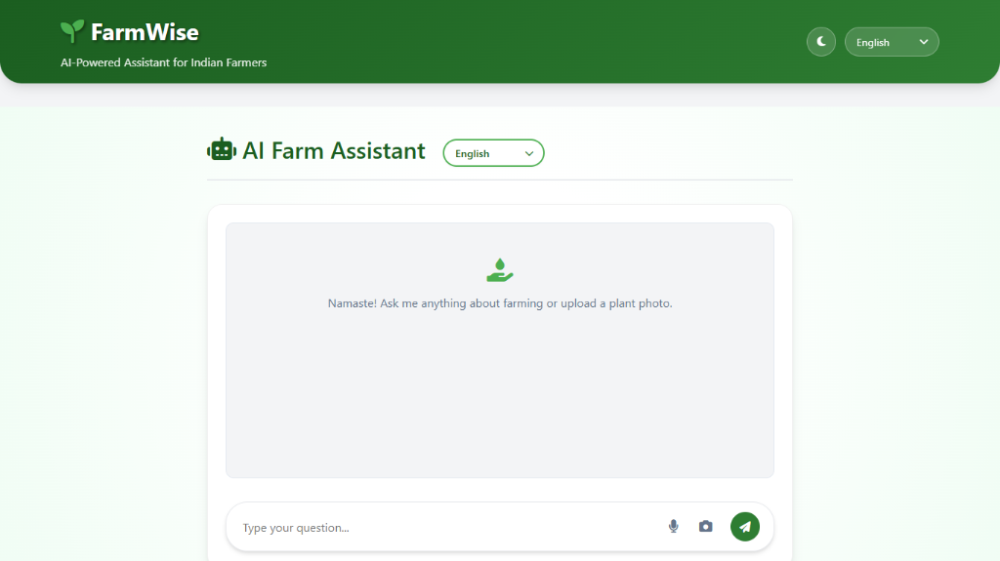

# 🌱 FarmWise: AI-Powered Agricultural Assistant

**FarmWise** is a smart, multilingual web application designed to empower Indian farmers. By leveraging Google's **Gemini AI**, it provides real-time plant disease detection, agricultural advice, weather updates, and market prices in multiple local languages.



## ✨ Features

-   **🤖 AI Plant Doctor**: Upload a photo of a sick plant, and Gemini AI will identify the disease and suggest sustainable treatments.
-   **🗣️ Multilingual Support**: Full text and voice support for **English, Hindi, Tamil, Malayalam, and Kannada**.
-   **🌦️ Real-Time Weather**: Accurate local weather forecasts and farming advisories based on current conditions.
-   **💰 Market Prices**: Check real-time Mandi prices for various crops across different Indian states.
-   **📜 Government Schemes**: Easy access to information about the latest government welfare schemes for farmers.
-   **🎙️ Voice Interaction**: Ask questions or listen to responses using integrated Speech-to-Text and Text-to-Speech.

## 🛠️ Tech Stack

-   **Backend**: Python (Flask)
-   **AI Model**: Google Gemini 2.5 Flash (via `google-generativeai`)
-   **Frontend**: HTML5, CSS3, JavaScript (Vanillajs)
-   **Data Sources**: 
    -   Weather API (WeatherAPI)
    -   Data.gov.in (Market Prices)
-   **Design**: Responsive UI with Dark Mode support

## 📁 Project Structure

```text
farmwise/
├── .gitignore          # Excludes API keys/secrets
├── .env.example        # Template for environment variables
├── README.md           # Project Documentation
├── app.py              # Main Flask Application
├── cropprice.csv       # Market Price Data
├── requirements.txt    # Project Dependencies
├── schemes.json        # Government Schemes Data
├── static/             # Static Assets
│   ├── css/            # Stylesheets
│   └── js/             # JavaScript Logic
└── templates/          # HTML Templates
    └── index.html      # Main Dashboard
```

## 🚀 Installation & Setup

Follow these steps to run the project locally on your machine.

### 1. Clone the Repository
```bash
git clone https://github.com/sanyamkansal/FarmWise
cd FarmWise
```

### 2. Create a Virtual Environment (Recommended)
```bash
python -m venv venv
# Windows
venv\Scripts\activate
# Mac/Linux
source venv/bin/activate
```

### 3. Install Dependencies
```bash
pip install -r requirements.txt
```

### 4. Configure Environment Variables
1.  Copy the example env file:
    ```bash
    cp .env.example .env
    ```
2.  Open `.env` and replace the placeholder values with your actual API Keys:
    ```env
    GEMINI_API_KEY=your_actual_gemini_key
    WEATHER_API_KEY=your_actual_weather_key
    ```

### 5. Run the Application
```bash
python app.py
```
Open your browser and visit: `http://localhost:5000`

## 🤝 Contributing

Contributions are welcome! Please feel free to submit a Pull Request.

1.  Fork the repository
2.  Create your feature branch (`git checkout -b feature/AmazingFeature`)
3.  Commit your changes (`git commit -m 'Add some AmazingFeature'`)
4.  Push to the branch (`git push origin feature/AmazingFeature`)
5.  Open a Pull Request

## 📄 License

This project is open-source and available under the [MIT License](LICENSE).

# 🌱 FarmWise: AI-Powered Agricultural Assistant

**FarmWise** is a smart, multilingual web application designed to empower Indian farmers. By leveraging Google's **Gemini AI**, it provides real-time plant disease detection, agricultural advice, weather updates, and market prices in multiple local languages.


## ✨ Features

-   **🤖 AI Plant Doctor**: Upload a photo of a sick plant, and Gemini AI will identify the disease and suggest sustainable treatments.
-   **🗣️ Multilingual Support**: Full text and voice support for **English, Hindi, Tamil, Malayalam, and Kannada**.
-   **🌦️ Real-Time Weather**: Accurate local weather forecasts and farming advisories based on current conditions.
-   **💰 Market Prices**: Check real-time Mandi prices for various crops across different Indian states.
-   **📜 Government Schemes**: Easy access to information about the latest government welfare schemes for farmers.
-   **🎙️ Voice Interaction**: Ask questions or listen to responses using integrated Speech-to-Text and Text-to-Speech.

## 🛠️ Tech Stack

-   **Backend**: Python (Flask)
-   **AI Model**: Google Gemini 2.5 Flash (via `google-generativeai`)
-   **Frontend**: HTML5, CSS3, JavaScript (Vanillajs)
-   **Data Sources**: 
    -   Weather API (WeatherAPI)
    -   Data.gov.in (Market Prices)
-   **Design**: Responsive UI with Dark Mode support

## 📂 Project Structure

```text
farmwise/
├── .gitignore          # Excludes API keys/secrets
├── .env.example        # Template for environment variables
├── README.md           # Project Documentation
├── app.py              # Main Flask Application
├── cropprice.csv       # Market Price Data
├── requirements.txt    # Project Dependencies
├── schemes.json        # Government Schemes Data
├── static/             # Static Assets
│   ├── css/            # Stylesheets
│   └── js/             # JavaScript Logic
└── templates/          # HTML Templates
    └── index.html      # Main Dashboard
```

## 🚀 Installation & Setup

Follow these steps to run the project locally on your machine.

### 1. Clone the Repository
```bash
git clone https://github.com/sanyamkansal/FarmWise
cd FarmWise
```

### 2. Create a Virtual Environment (Recommended)
```bash
python -m venv venv
# Windows
venv\Scripts\activate
# Mac/Linux
source venv/bin/activate
```

### 3. Install Dependencies
```bash
pip install -r requirements.txt
```

### 4. Configure Environment Variables
1.  Copy the example env file:
    ```bash
    cp .env.example .env
    ```
2.  Open `.env` and replace the placeholder values with your actual API Keys:
    ```env
    GEMINI_API_KEY=your_actual_gemini_key
    WEATHER_API_KEY=your_actual_weather_key
    ```

### 5. Run the Application
```bash
python app.py
```
Open your browser and visit: `http://localhost:5000`

## 🤝 Contributing

Contributions are welcome! Please feel free to submit a Pull Request.

1.  Fork the repository
2.  Create your feature branch (`git checkout -b feature/AmazingFeature`)
3.  Commit your changes (`git commit -m 'Add some AmazingFeature'`)
4.  Push to the branch (`git push origin feature/AmazingFeature`)
5.  Open a Pull Request

## 📄 License

This project is open-source and available under the [MIT License](LICENSE).
